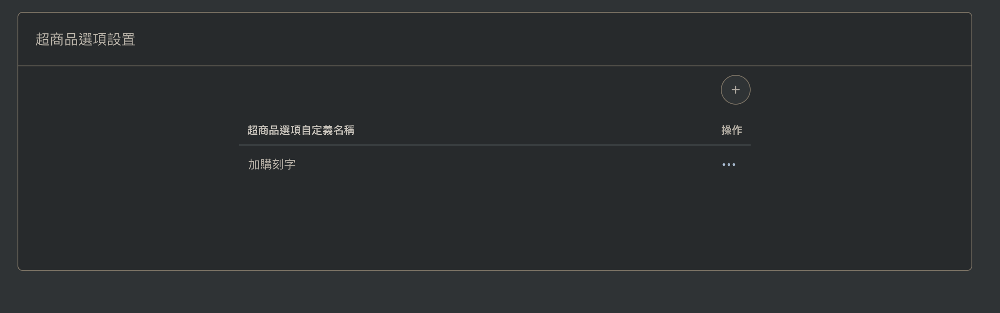
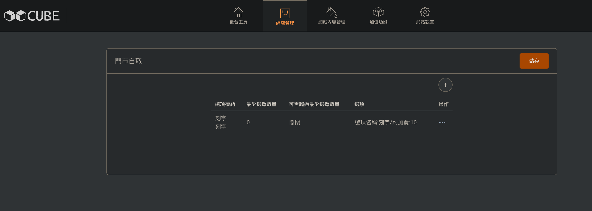
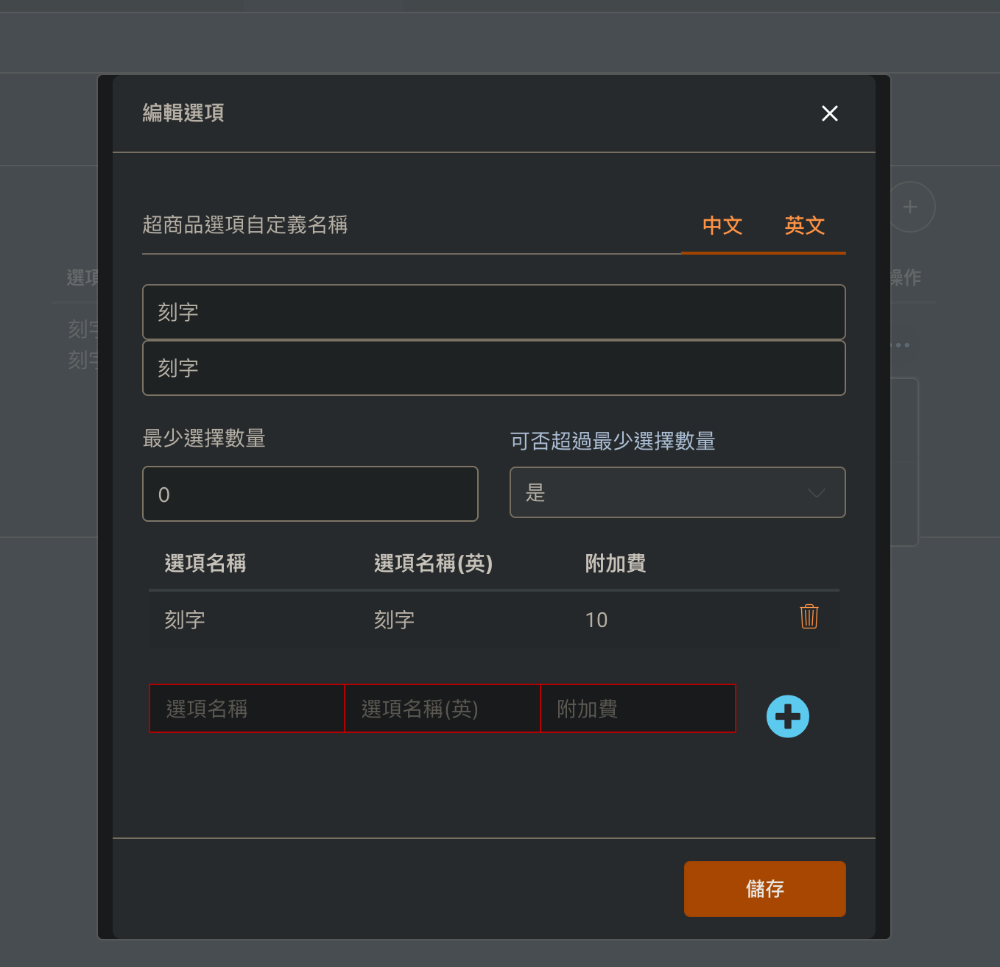
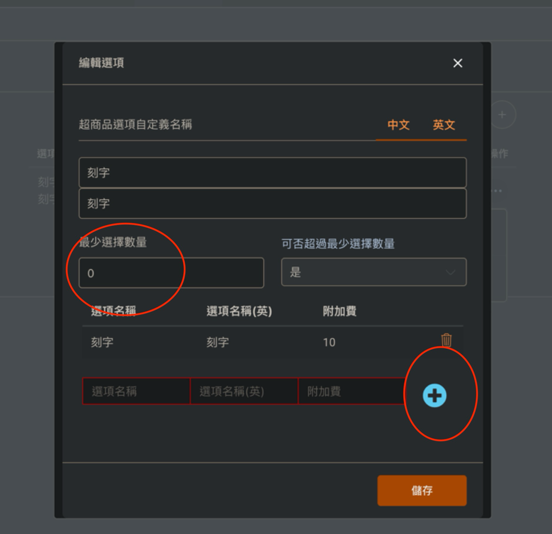
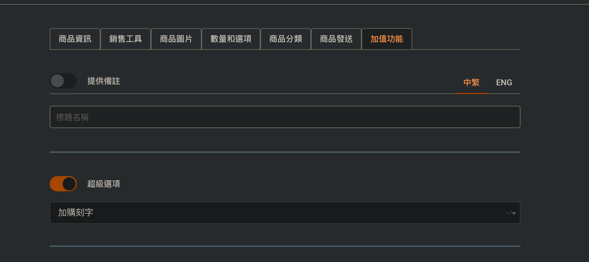

# CUBE 說明書：商品「超級選項」

適用範圍：CUBE 後台 → 網店管理 → 商品／超商品選項設置
文件版本：v1.0

---

## 目錄

1. [什麼是超級選項](#1-什麼是超級選項)
2. [整體操作流程](#2-整體操作流程)
3. [步驟一：建立超級選項組](#3-步驟一建立超級選項組)
4. [步驟二：新增選項標題與選項內容](#4-步驟二新增選項標題與選項內容)
5. [欄位說明總表](#5-欄位說明總表)
6. [步驟三：套用到商品](#6-步驟三套用到商品)
7. [附加費如何計算](#7-附加費如何計算)
8. [常見錯誤與注意事項](#8-常見錯誤與注意事項)
9. [常見問題 FAQ](#9-常見問題-faq)

---

## 1. 什麼是超級選項

「超級選項」係俾客人喺落單時，喺商品基本規格（顏色、尺寸等）之外，額外加購或者揀選附加服務嘅功能。

常見用法：

| 用途 | 例子 |
| --- | --- |
| 加購服務 | 加購刻字、加購禮盒包裝、加購賀卡 |
| 附加配件 | 加購電池、加購保護套 |
| 取貨／服務方式 | 門市自取地點、送貨時段 |
| 口味／配料 | 加配料、加大份量 |

特點：

- 每個選項可以設定**附加費**，客人揀咗之後會自動加入商品售價。
- 支援**中文／英文**兩種語言名稱，配合多語言網店。
- 可以設定**最少選擇數量**，做到「必選」或者「非必選」。
- 一組超級選項可以**重複套用**喺多個商品，唔使逐個商品重新輸入。

---

## 2. 整體操作流程

```
① 建立超級選項組（超商品選項設置）
        ↓
② 喺組入面新增「選項標題」，再喺標題入面新增每個「選項」與附加費
        ↓
③ 去商品編輯頁 → 加值功能 → 開啟「超級選項」→ 揀返啱嘅選項組
        ↓
④ 儲存，前台商品頁即時顯示
```

---

## 3. 步驟一：建立超級選項組

路徑：**後台 → 網店管理 → 超商品選項設置**



1. 進入「超商品選項設置」頁面，畫面會列出所有已建立嘅選項組（例：`加購刻字`）。
2. 撳右上角嘅 **`+`** 按鈕新增一組。
3. 已有嘅選項組，撳最右邊「操作」欄嘅 **`…`**，可以做編輯／刪除等動作。

> 建議：一組選項組代表一種用途（例如「加購刻字」、「禮盒包裝」），命名要一睇就明，方便日後套用到商品。

---

## 4. 步驟二：新增選項標題與選項內容

進入選項組之後，會見到該組內嘅「選項標題」列表。



列表欄位：

| 欄位 | 說明 |
| --- | --- |
| 選項標題 | 前台顯示嘅標題（上行中文、下行英文） |
| 最少選擇數量 | 客人最少要揀幾多個 |
| 可否超過最少選擇數量 | 顯示現時設定（開啟／關閉） |
| 選項 | 該標題底下所有選項及附加費摘要，例如「選項名稱:刻字/附加費:10」 |
| 操作 | `…` 可作編輯／刪除 |

撳右上角 **`+`** 新增選項標題，或者撳 `…` → 編輯，就會彈出「編輯選項」視窗。

### 「編輯選項」視窗



1. **超商品選項自定義名稱**
   - 右上角有 **中文 / 英文** 分頁，兩個分頁都要各自填寫。
   - 上面一格係主標題，下面一格係副標題／說明文字。
2. **最少選擇數量**：填數字，`0` 代表非必選。
3. **可否超過最少選擇數量**：喺下拉選單揀 `是` 或 `否`。
4. **選項清單**：每一行係一個選項，包含「選項名稱」、「選項名稱(英)」、「附加費」。
   - 想刪除某一行，撳右邊嘅 🗑 垃圾桶圖示。
5. 全部填好之後，撳右下角 **「儲存」**。

### 新增一個選項的正確做法（重點）



最底嗰行係**輸入行**，唔係已加入嘅選項。正確步驟：

1. 喺輸入行填入「選項名稱」、「選項名稱(英)」、「附加費」。
2. **必須撳右邊藍色 `+` 按鈕**，該行先會加入到上面嘅選項清單。
3. 重複 1–2 步，加入其他選項。
4. 最後撳 **「儲存」**。

> ⚠️ 輸入行顯示**紅色框**，代表呢一行仲未加入清單（未撳 `+`）。如果直接撳儲存，呢行資料會遺失。

---

## 5. 欄位說明總表

| 欄位 | 輸入方式 | 說明 | 例子 |
| --- | --- | --- | --- |
| 超商品選項自定義名稱（中文） | 文字 | 前台中文版顯示嘅標題 | 刻字 |
| 超商品選項自定義名稱（英文） | 文字 | 前台英文版顯示嘅標題 | Engraving |
| 最少選擇數量 | 數字 | `0` = 非必選；`1` = 至少要揀 1 個（必選）；`2` = 至少揀 2 個⋯⋯ | 0 |
| 可否超過最少選擇數量 | 是／否 | `是` = 可以揀多過最少數量（多選）；`否` = 只可以照最少數量揀 | 是 |
| 選項名稱 | 文字 | 客人見到嘅選項中文名 | 刻字 |
| 選項名稱(英) | 文字 | 客人見到嘅選項英文名 | Engraving |
| 附加費 | 數字 | 揀咗此選項要額外加嘅金額，只填數字，唔好加貨幣符號 | 10 |

### 「最少選擇數量」＋「可否超過」組合效果

| 最少選擇數量 | 可否超過 | 實際效果 |
| --- | --- | --- |
| 0 | 是 | 非必選，可揀任意多個 |
| 0 | 否 | 非必選；如果要揀就只可以揀返指定數量 |
| 1 | 否 | 必選，而且只可以揀 1 個（單選） |
| 1 | 是 | 必選，最少 1 個，可以揀多過 1 個 |
| 2 | 是 | 必選，最少 2 個，可以再加 |

---

## 6. 步驟三：套用到商品

路徑：**後台 → 網店管理 → 商品 → 編輯商品 → 「加值功能」分頁**



1. 喺商品編輯頁最右邊嘅 **「加值功能」** 分頁。
2. 搵到 **「超級選項」** 開關，撳一下轉做**開啟**（橙色）。
3. 喺下面嘅下拉選單，揀返之前建立好嘅選項組（例：`加購刻字`）。
4. 撳商品頁嘅 **「儲存」**。
5. 去前台商品頁刷新，就會見到超級選項顯示出嚟。

> 同一頁上面嘅 **「提供備註」** 係另一個功能：開啟後客人可以喺落單時輸入文字備註，「標題名稱」就係俾客人見到嘅提示文字（中繁／ENG 分開填）。如果係刻字之類需要客人輸入內容嘅服務，可以同時開啟「提供備註」，方便客人寫低要刻嘅字。

---

## 7. 附加費如何計算

- 客人每揀一個有附加費嘅選項，該金額就會加入商品小計。
- 例：商品售價 $100，揀咗「刻字（附加費 10）」→ 該件商品變成 $110。
- 多選情況下，所有已揀選項嘅附加費會**逐一累加**。
- 附加費為 `0` 嘅選項，代表免費選項（例如揀顏色、揀口味）。

---

## 8. 常見錯誤與注意事項

| 情況 | 原因 | 解決方法 |
| --- | --- | --- |
| 儲存後選項唔見咗 | 輸入行未撳藍色 `+` 就撳儲存 | 重新輸入，撳 `+` 令佢加入清單後先儲存 |
| 輸入行變紅框 | 該行仲未加入清單／未填齊必填欄位 | 填齊資料再撳 `+` |
| 英文版前台空白 | 只填咗「中文」分頁 | 切去「英文」分頁補返英文名稱 |
| 前台無顯示超級選項 | 商品未開啟「超級選項」開關，或者未揀選項組 | 商品 → 加值功能 → 開啟開關並揀返選項組，再儲存 |
| 附加費無加到價錢 | 附加費欄留空或者填咗非數字 | 只填數字（例：`10`），唔好加 `$` 或者逗號 |
| 改完設定前台無變 | 未撳「儲存」，或者瀏覽器快取 | 撳「儲存」後刷新前台頁面 |
| 客人被迫要揀 | 「最少選擇數量」填咗 1 或以上 | 改返做 `0` 就變成非必選 |

其他注意事項：

- **每一層都要獨立儲存**：編輯選項視窗撳「儲存」之後，仲要撳返頁面上嘅「儲存」。
- **刪除有影響範圍**：刪除一個選項組之前，先確認冇商品仲用緊佢，否則相關商品會失去該組選項。
- **已落單記錄唔會改變**：修改或刪除選項只影響之後嘅新訂單，已完成嘅訂單記錄維持原狀。
- **命名要清楚**：前台直接顯示你填嘅名稱，避免用內部代號。

---

## 9. 常見問題 FAQ

**Q1：一個商品可以套用幾多組超級選項？**
喺「加值功能」分頁揀一組選項組；如果需要多種加購項目，可以喺同一組選項組入面新增多個「選項標題」（例如同一組入面有「刻字」同「禮盒包裝」兩個標題）。

**Q2：超級選項同「數量和選項」分頁有咩分別？**
「數量和選項」係商品本身嘅規格／庫存（例如尺寸、顏色，各自有庫存數量）；超級選項係附加服務／加購項目，主要用嚟加價，唔佔用商品規格庫存。

**Q3：可唔可以做免費選項？**
可以，附加費填 `0` 即可。

**Q4：點樣暫時停用超級選項？**
去商品 → 加值功能，將「超級選項」開關轉做關閉再儲存，選項組本身唔會被刪除，日後可隨時再開返。

**Q5：客人可唔可以自己輸入文字（例如要刻咩字）？**
超級選項本身係揀選式。如果要客人輸入文字，請同時開啟同一頁嘅「提供備註」功能，並喺「標題名稱」填上提示（例如「請輸入刻字內容」）。

**Q6：選項可唔可以排序？**
選項會按加入嘅先後次序顯示，所以請按你想要嘅前台次序逐個加入。
