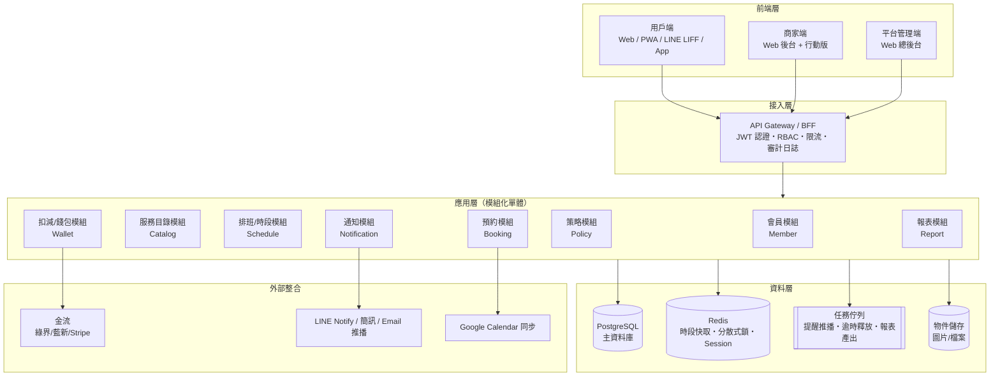

# 01. 架構總覽

## 1. 整體架構

採「**單體優先、模組化設計**」策略：初期以模組化單體（Modular Monolith）開發，模組邊界清楚，未來流量成長時可將「時段引擎」「通知服務」等拆為獨立服務。

## 2. 模組職責

| 模組 | 職責 | 關鍵設計點 |
|---|---|---|
| **會員 Member** | 註冊登入、個人資料、會員等級、商家—會員關係 | 一個使用者帳號可以是多家商家的會員（多對多） |
| **服務目錄 Catalog** | 預約項目（服務/課程）、分類、服務時長、緩衝時間、定價與扣減規則 | 服務時長 = 實際服務時間 + 前後緩衝（清潔/準備） |
| **排班 Schedule** | 服務人員班表（工作時長）、休假、特殊營業日、資源（房間/設備）容量 | 班表以「規則 + 例外」儲存，不展開存每一天 |
| **預約 Booking** | 可預約時段查詢、下單、狀態機（改期/取消/爽約由商家操作） | 併發防超賣：Redis 鎖 + DB 唯一約束雙保險 |
| **扣減 Wallet** | 儲值金、點數、堂數卡（方案）；扣減、返還、過期 | 帳本式設計（append-only ledger），餘額可稽核重算 |
| **策略 Policy** | 預約規則：提前預約期限、取消返還試算、爽約罰則 | 商家層級預設 + 單一服務項目可覆寫；商家操作時可個案調整 |
| **通知 Notification** | 預約成立/提醒/異動通知，多通道（LINE、簡訊、Email、App 推播） | 事件驅動：訂閱 Booking 的領域事件 |
| **報表 Report** | 營收、出席率、爽約率、人員稼動率、熱門時段 | 讀寫分離，報表查唯讀副本或預先彙總表 |

## 3. 技術選型建議

| 層 | 建議 | 備選 |
|---|---|---|
| 用戶端 | **LINE LIFF + Web（Next.js）**（台灣市場觸及率高、免安裝） | React Native / Flutter App |
| 商家端 | Web 後台（Next.js / Vue3 + Ant Design）＋ 響應式支援手機 | 獨立商家 App |
| 平台管理端 | 同商家端技術棧，獨立部署 | — |
| 後端 | **Node.js（NestJS）** 或 **Java（Spring Boot）**，模組化單體 | Go / Python(FastAPI) |
| 資料庫 | **PostgreSQL**（交易一致性 + JSONB 彈性欄位） | MySQL 8 |
| 快取/鎖 | Redis | — |
| 佇列 | BullMQ（Node）/ RabbitMQ | Kafka（量大後） |
| 部署 | Docker + 雲端託管（AWS/GCP），初期單區域 | K8s（多商家量大後） |

## 4. 關鍵非功能需求

1. **併發正確性**：同一時段不可超賣。做法：`SELECT ... FOR UPDATE` / 唯一索引（人員+時段）+ Redis 分散式鎖做前置過濾。
2. **扣減一致性**：預約與扣減必須在同一 DB 交易內完成；返還走補償交易並留帳本紀錄。
3. **多租戶隔離**：所有商家資料表帶 `merchant_id`，API 層強制注入過濾（Row-Level 隔離），杜絕跨商家越權。
4. **時區**：資料庫一律存 UTC，顯示依商家時區設定轉換（預設 Asia/Taipei）。
5. **可稽核**：預約狀態異動、扣減異動均寫入不可變日誌（誰、何時、從什麼狀態到什麼狀態、原因）。
