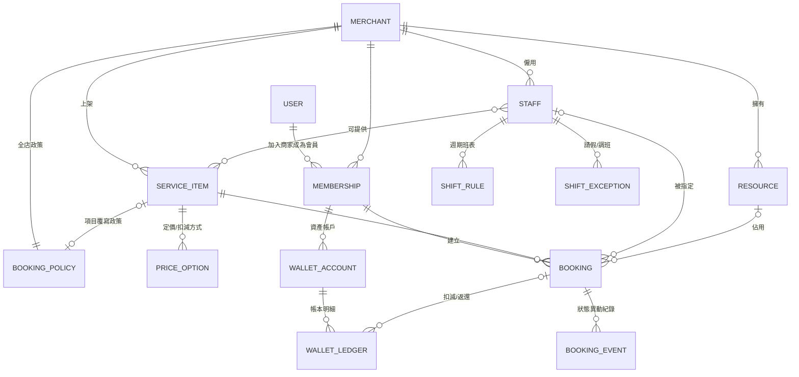

# 03. 資料模型設計

## 1. ERD 總覽



## 2. 核心資料表

> 慣例：所有表含 `id (uuid)`、`created_at`、`updated_at`；商家範圍的表一律含 `merchant_id` 以做多租戶隔離。時間一律存 UTC（`timestamptz`）。

### 2.1 使用者與會員

```sql
-- 平台級使用者帳號（一個帳號可屬於多家商家）
user (
  id, phone UNIQUE, email, line_user_id, name, avatar_url,
  status  -- active / suspended
)

-- 商家（租戶）
merchant (
  id, name, slug UNIQUE, timezone DEFAULT 'Asia/Taipei',
  business_hours JSONB,          -- 每週營業時間
  plan,                          -- 平台訂閱方案
  status                         -- pending / active / suspended
)

-- 會員關係（user × merchant）
membership (
  id, merchant_id, user_id,
  level,                         -- 會員等級
  tags TEXT[],                   -- 分群標籤
  no_show_count INT DEFAULT 0,   -- 累計爽約
  booking_blocked_until,         -- 罰則：暫停預約至
  UNIQUE(merchant_id, user_id)
)
```

### 2.2 服務目錄（預約項目）

```sql
-- 預約項目
service_item (
  id, merchant_id, category_id, name, description, images JSONB,
  kind,                    -- personal(一對一) / group(團課) / resource(場地)
  duration_min INT,        -- 服務時長（分鐘）
  buffer_before_min INT DEFAULT 0,   -- 前置準備
  buffer_after_min INT DEFAULT 0,    -- 後置緩衝（清潔等）
  capacity INT DEFAULT 1,  -- 團課名額；一對一固定 1
  policy_id,               -- 覆寫政策（NULL = 用全店預設）
  status                   -- draft / published / archived
)

-- 定價 / 扣減方式（一個項目可有多種，會員擇一）
price_option (
  id, service_item_id,
  pay_type,                -- cash(現金) / stored_value(儲值金) / points(點數) / pass(堂數卡)
  amount NUMERIC,          -- 金額或點數；pass 時 = 扣幾堂
  pass_product_id          -- pay_type=pass 時，限定哪種卡可扣（NULL=任一適用卡）
)

-- 可提供此項目的服務人員
staff_service (staff_id, service_item_id, PRIMARY KEY(staff_id, service_item_id))
```

### 2.3 人員排班（工作時長）

```sql
-- 商家員工/服務人員
staff (
  id, merchant_id, user_id,        -- 綁定平台帳號（可為 NULL：純排班用）
  role,                            -- owner / staff / provider
  display_name, title, avatar_url,
  bookable BOOLEAN                 -- 是否開放被預約
)

-- 週期性班表規則（工作時長）
shift_rule (
  id, staff_id,
  weekday INT,             -- 0~6
  start_time TIME, end_time TIME,  -- 商家時區的本地時間
  break_slots JSONB,       -- 休息時段 [{start,end}]
  effective_from DATE, effective_to DATE
)

-- 班表例外：請假、調班、加班
shift_exception (
  id, staff_id, date DATE,
  type,                    -- off(整天休) / override(改時段)
  start_time TIME, end_time TIME,  -- override 用
  reason
)

-- 資源（房間 / 設備 / 場地）
resource (
  id, merchant_id, name, capacity INT DEFAULT 1, open_hours JSONB
)
```

### 2.4 預約

```sql
booking (
  id, merchant_id,
  membership_id,           -- 會員（可 NULL = 非會員/臨時客，由商家端代建）
  guest_name, guest_phone, -- membership_id 為 NULL 時必填（walk-in 客資）
  service_item_id,
  staff_id,                -- 目前生效的服務人員（NULL = 待指派）
  assignment_status,       -- unassigned(待指派) / proposed(已指派待確認) /
                           --   confirmed(指派確定)；防超賣約束以 staff_id 為準
  resource_id,             -- 佔用資源（可 NULL）
  start_at TIMESTAMPTZ,    -- 服務開始
  end_at TIMESTAMPTZ,      -- 服務結束（含時長，不含 buffer）
  block_start_at, block_end_at,  -- 實際佔用區間（含前後 buffer），排程判斷用
  status,                  -- 見 04 狀態機：pending/confirmed/
                           --   completed/cancelled/no_show/rescheduled
  price_option_id,         -- 選用的扣減方式（可 NULL = 到店付款/現金）
  reschedule_count INT DEFAULT 0,
  rescheduled_from_id,     -- 改期來源預約（保留軌跡）
  late_note,               -- 遲到註記（商家填，例「來電說晚到20分」，行事曆顯示 ⏰）
  source,                  -- member_app(會員自訂) / staff(商家代客) / admin(平台)
  policy_override BOOLEAN DEFAULT false,  -- 商家代客時是否越過政策限制
  override_reason,         -- 越過政策的原因（policy_override=true 時必填）
  created_by_staff_id,     -- source=staff 時記錄操作員工
  recurring_group_id,      -- 重複性預約批次 ID（同批共用，可整批操作）
  note
)

-- 防超賣：同一人員同一時間區間不可重疊（PostgreSQL 排除約束）
-- EXCLUDE USING gist (staff_id WITH =, tstzrange(block_start_at, block_end_at) WITH &&)
--   WHERE (status IN ('pending','confirmed'))

-- 預約狀態異動日誌（不可變）
booking_event (
  id, booking_id, from_status, to_status,
  actor_type,              -- member / staff / system
  actor_id,                -- actor_type=staff 時 = staff.id（記錄哪位同事操作）
  reason, created_at
)

-- 派工/指派紀錄（每次指派、改派都留一筆，與預約單解耦）
booking_assignment (
  id, booking_id,
  staff_id,                -- 被指派的員工
  status,                  -- proposed(待員工確認) / accepted(員工接受) /
                           --   rejected(員工拒絕) / replaced(被改派取代) /
                           --   auto_confirmed(免確認直接生效)
  assign_type,             -- member_specified(會員指定) / manual(老闆指派) /
                           --   auto(系統自動派工)
  assigned_by_staff_id,    -- 指派操作者（老闆/店務；auto 時為 NULL）
  reason,                  -- 指派/改派原因（改派時必填）
  notify_member BOOLEAN,   -- 此次異動是否通知會員
  created_at, responded_at -- responded_at = 員工接受/拒絕時間
)
-- booking.staff_id 永遠指向「目前生效」的那一筆 accepted/auto_confirmed 指派
-- 歷史軌跡（誰派過、誰拒絕過、為何換人）全部保留在此表

-- 員工操作紀錄（append-only，涵蓋預約以外的所有商家端操作）
operation_log (
  id, merchant_id,
  staff_id,                -- 操作的員工
  action,                  -- booking_create / booking_reschedule / booking_cancel /
                           --   check_in / mark_no_show / wallet_adjust /
                           --   policy_update / service_update / shift_update ...
  target_type, target_id,  -- 操作對象（booking / wallet_account / service_item ...）
  detail JSONB,            -- 異動前後值快照
  ip, created_at
)
-- 索引：operation_log(merchant_id, staff_id, created_at DESC) 供「查某同事的操作紀錄」
```

### 2.5 扣減 / 錢包（帳本式）

```sql
-- 可販售的卡/方案商品（例：瑜伽 10 堂卡、儲值 $3000 送 $300）
pass_product (
  id, merchant_id, name,
  type,                    -- pass(堂數) / stored_value / points
  total_units NUMERIC,     -- 10 堂 / 3300 元 / 500 點
  price NUMERIC,           -- 售價
  valid_days INT,          -- 購買後有效天數
  applicable_items JSONB   -- 適用的 service_item（NULL=全部）
)

-- 會員資產帳戶（每買一張卡開一個帳戶；儲值/點數每會員各一個）
wallet_account (
  id, membership_id, pass_product_id,
  type,                    -- pass / stored_value / points
  balance NUMERIC,         -- 目前餘額（由 ledger 累計，可重算稽核）
  expires_at
)

-- 帳本（append-only，不可修改與刪除）
wallet_ledger (
  id, wallet_account_id,
  change NUMERIC,          -- +購買/返還/調帳；-扣減/過期
  balance_after NUMERIC,
  reason,                  -- purchase / booking_deduct / booking_refund /
                           --   manual_adjust / expire
  booking_id,              -- 關聯預約（扣減/返還時）
  operator_id, note, created_at
)
```

### 2.6 政策（取消返還 / 爽約罰則）

> 遲到、改期、取消均由商家端人工操作，政策規則作為**返還試算與罰則的預設值**，商家可個案調整（調整需填原因、留稽核）。

```sql
booking_policy (
  id, merchant_id,
  min_lead_min INT,          -- 最晚需提前 N 分鐘預約
  max_lead_days INT,         -- 最早可提前 N 天預約
  cancel_rules JSONB,          -- 取消返還試算預設：[{before_min: 1440, refund_pct: 100},
                               --  {before_min: 0,    refund_pct: 50}]
  no_show_penalty JSONB,       -- 商家標記爽約時自動套用：{block_days: 7, forfeit_deduction: true}
  max_active_bookings INT,     -- 同時持有預約上限
  need_approval BOOLEAN,       -- 預約是否需商家審核
  -- 派工相關
  auto_assign_strategy,        -- none(純手動) / round_robin(輪流) /
                               --   least_loaded(最少負載) / senior_first(資深優先)
  require_staff_confirm BOOLEAN,  -- 指派後是否需員工確認（否=直接生效）
  staff_confirm_timeout_min INT,  -- 員工逾時未確認 → 退回待指派並提醒老闆
  assign_lock_before_min INT,     -- 開始前 N 分鐘鎖定指派（之後改派需 Owner 權限）
  notify_member_on_reassign,      -- always(必通知) / if_specified(會員有指定人員才通知) / never
  member_can_reject_reassign BOOLEAN  -- 會員指定的人員被換時，會員可否要求改期/取消不罰
)
```

## 3. 索引與效能重點

| 場景 | 設計 |
|---|---|
| 查某人員某天的預約 | `booking(staff_id, block_start_at)` 複合索引 |
| 查會員的預約列表 | `booking(membership_id, start_at DESC)` |
| 防超賣 | GiST 排除約束（見上）＋ Redis 鎖前置過濾 |
| 可預約時段計算 | 班表規則展開結果以 `merchant:staff:date` 為 key 快取於 Redis，預約異動時失效 |
| 餘額查詢 | `wallet_account.balance` 反正規化欄位，帳本為準可重算 |
