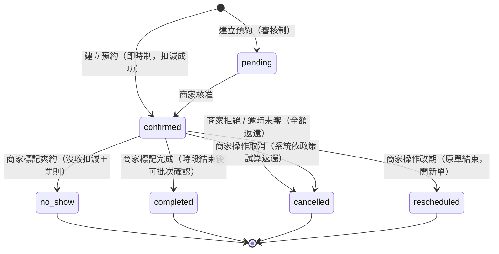
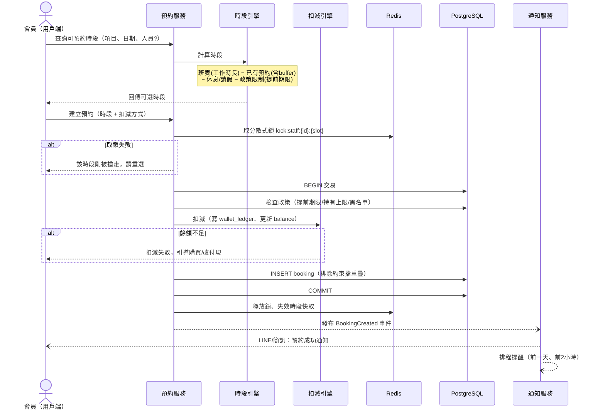
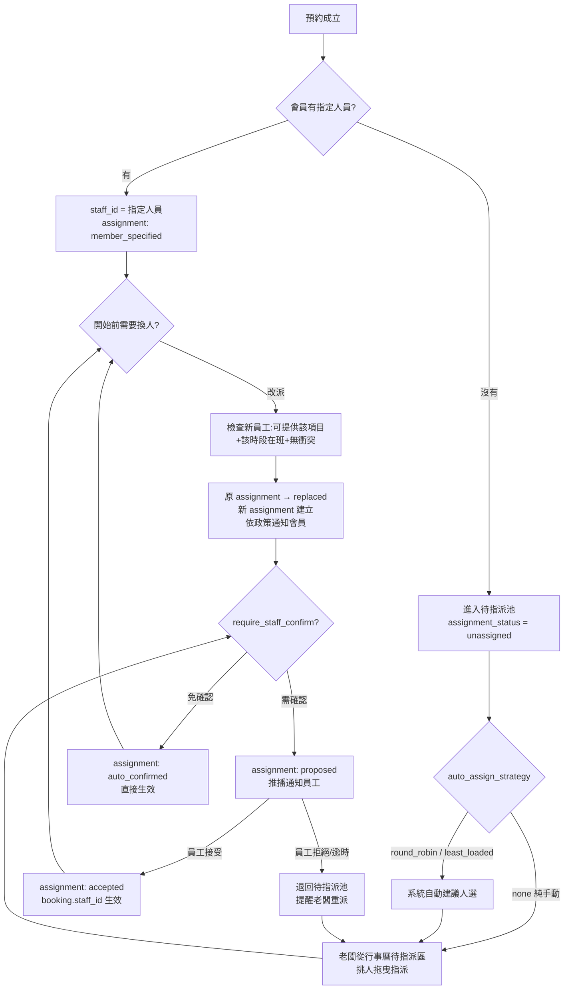

# 04. 核心流程設計

## 1. 預約狀態機（簡化版：無報到流程，異動由商家操作）

> 設計決策：不做報到（check-in）與自動遲到倒數。客人遲到、改期、取消一律聯絡商家，由商家端人工操作；系統負責把關（衝突檢查、返還計算）與留痕。



**狀態說明**

| 狀態 | 說明 | 扣減 |
|---|---|---|
| pending | 待商家審核（`need_approval=true` 時） | 已預扣（凍結） |
| confirmed | 預約成立 | 已扣減 |
| completed | 服務完成（商家標記，可批次） | 扣減確定 |
| cancelled | 取消（商家操作） | 依取消政策比例返還，商家可調整 |
| rescheduled | 已改期（軌跡保留，新單接續） | 扣減轉移至新單 |
| no_show | 爽約（商家標記） | 依政策沒收；累計爽約次數、觸發罰則 |

**遲到的處理（非獨立狀態）**：遲到不進狀態機。客人來電說會晚到 → 商家在預約單上加註記（`late_note`），行事曆顯示 ⏰ 標示；之後由商家依實際情況選擇：照常服務（不動）、改期（rescheduled）、或標記爽約（no_show）。

## 2. 建立預約流程（含扣減與防超賣）



**要點**
- 扣減與建立預約在**同一個 DB 交易**：任一步失敗全部回滾。
- 雙重防超賣：Redis 鎖（快速失敗）＋ DB 排除約束（最終防線）。
- 「不指定人員」：時段引擎回傳「任一可用人員」的聯集時段，成立時以負載均衡指派。

## 2.1 商家端建立預約（代客預約）

與會員自訂共用同一套預約引擎（防超賣、扣減交易、狀態機皆相同），差異如下：

```
商家端員工（Staff/Owner）發起代客預約
 ├─ 選擇客人：
 │    ├─ 既有會員：搜尋姓名/手機 → membership_id
 │    └─ 非會員（walk-in / 電話客）：填姓名+電話 → guest_name/guest_phone
 ├─ 選項目、人員、時段（行事曆直接點選，即時顯示衝突）
 ├─ 扣減方式：
 │    ├─ 會員：扣卡 / 扣點 / 扣儲值（走扣減引擎，同交易）
 │    └─ 非會員或到店付款：price_option_id = NULL，現場結帳
 ├─ 政策檢查：
 │    ├─ 預設仍套用（提前期限、持有上限）
 │    └─ 有權限者可勾選「越過限制」→ policy_override=true，
 │        必填 override_reason，寫入操作紀錄
 └─ 成立時記錄：source=staff、created_by_staff_id=操作員工
      → 同步寫 booking_event（actor=該員工）與 operation_log
      → 通知客人（會員推播；非會員發簡訊）

重複性預約：選週期（每週三 19:00 × 8 週）→ 逐週檢查衝突
 → 全部無衝突才整批成立（或列出衝突週讓員工逐筆決定）
 → 同批共用 recurring_group_id，可整批改期/取消
```

**操作可追溯性**：預約由誰建立（`created_by_staff_id`）、每次狀態異動由誰操作（`booking_event.actor_id`）、有無越過政策（`policy_override + override_reason`）全部留痕，商家端可依員工查詢操作紀錄（見 `operation_log`）。

## 2.2 派工流程（老闆安排員工到已預約時段）

### 設計原則：預約單與員工指派解耦

「客人約的時段」和「誰去服務」是兩件事。預約單（booking）承載時段與扣減，指派（booking_assignment）承載人員安排 — **換人時預約單完全不動**（時段不變、扣減不變、不驚動客人的預約權益），只有指派紀錄異動。這是彈性的來源。



### 老闆指派的操作介面（商家端）

1. **待指派看板**：行事曆上「未指派」預約以醒目色塊顯示，並有待指派列表（按開始時間排序、緊急的置頂）
2. **挑人時系統即時顯示每位員工的可用性**：
   - ✅ 可指派：該時段在班、無衝突、會該項目
   - ⚠️ 可指派但需注意：當天已排 N 單（過載提示）、與前一單地點/房間接續太緊
   - ❌ 不可指派：不在班、時段衝突、不會該項目（灰掉但顯示原因）
3. **拖曳指派**：把預約卡片拖到員工的行事曆欄位即完成指派
4. **批次指派**：一天的待指派單可一鍵套用自動派工建議，再逐筆微調

### 彈性機制

| 機制 | 說明 |
|---|---|
| **自動派工策略** | `round_robin` 輪流 / `least_loaded` 當日最少單優先 / `senior_first` 資深優先；自動結果老闆永遠可改 |
| **員工確認制（可關）** | 開啟時指派先為 `proposed`，員工 App 接受才生效；逾時未回退回待指派並提醒老闆 |
| **改派（換人）** | 任何時候可換人；新員工過三重檢查（會項目/在班/無衝突）；原指派標 `replaced` 留痕不刪 |
| **指派鎖定期** | 開始前 N 分鐘（`assign_lock_before_min`）後改派需 Owner 權限，避免臨場混亂 |
| **會員通知政策** | `always` / `if_specified`（會員原本有指定人員才通知）/ `never`；會員指定的人被換掉時，可設定允許會員免罰改期或取消 |
| **防超賣一致性** | DB 排除約束以 `booking.staff_id` 為準：改派 = 同一交易內更新 staff_id，新人時段被佔會直接失敗回滾 |

### 改派（換人）交易流程

```
老闆對 booking 發起改派 → 新員工 staff_B
 ├─ 檢查鎖定期：距開始 < assign_lock_before_min 且非 Owner → 拒絕
 ├─ 三重檢查 staff_B：staff_service 有該項目？當日在班？時段無衝突？
 └─ 交易內執行：
      1. 原 assignment → status = replaced
      2. INSERT 新 assignment（assign_type=manual, assigned_by=老闆, reason 必填）
      3. UPDATE booking.staff_id = staff_B（排除約束把關，衝突即回滾）
      4. 寫 operation_log（誰、何時、A 換成 B、原因）
 └─ 交易成功後：
      - 通知 staff_A（單被移走）、staff_B（新任務，需確認制則走 proposed）
      - 依 notify_member_on_reassign 決定是否通知會員
      - 失效兩位員工的時段快取
```

## 3. 可預約時段計算（時段引擎）

```
輸入：service_item（時長+buffer）、日期、staff（可選）、merchant policy

步驟：
1. 取人員當日工作時長：shift_rule 展開 + shift_exception 覆寫
2. 扣除休息時段 break_slots
3. 取當日既有預約的佔用區間（block_start_at ~ block_end_at）
4. 剩餘空檔切成候選時段：
     步進 = 商家設定的時段粒度（例 15/30 分鐘）
     候選需容納 buffer_before + duration + buffer_after
5. 過濾政策：now + min_lead_min 之後、max_lead_days 之內
6. 資源型/團課：再檢查 resource 容量 / 團課剩餘名額
7. 結果快取 Redis（key: 商家:人員:日期），預約異動時主動失效
```

## 4. 改期流程（商家操作）

```
客人聯絡商家要求改期（電話 / LINE）
 └─ 商家端在行事曆找到該預約 → 選擇新時段（同「可預約時段計算」，
    即時顯示衝突）→ 確認
 └─ 交易內執行：
      1. 原 booking → status = rescheduled
      2. 建立新 booking（rescheduled_from_id 指向原單，
         reschedule_count + 1，扣減紀錄沿用、不重扣）
      3. 寫 booking_event（actor=操作員工）、operation_log
 └─ 通知客人新時段、重排提醒
```

- 商家操作不受期限限制，隨時可改；`reschedule_count` 仍累計，供商家判斷慣性改期的客人。
- 拖曳改期：行事曆直接把預約卡片拖到新時段，同一套交易流程。

## 5. 遲到處理（商家人工處理，無自動流程）

```
客人來電：「我會晚到 20 分鐘」
 └─ 商家在預約單加遲到註記（late_note: "晚到20分"）
    → 行事曆該卡片顯示 ⏰ 遲到標示，服務人員即時看到
 └─ 商家依現場狀況擇一處理：
      a. 照常服務（不動單，可口頭告知服務可能縮短）
      b. 幫客人改期（走改期流程）
      c. 客人最後沒來 → 商家標記爽約（走 no_show）
```

- 沒有自動 late → no_show 排程；爽約認定完全由商家判斷後手動標記，避免誤判引起糾紛。
- 標記爽約時系統依 `no_show_penalty` 自動執行罰則（沒收扣減、記點、暫停預約 N 天），商家可在確認畫面上調整（例如熟客免罰）。

## 6. 取消與返還（商家操作）

```
客人聯絡商家取消 at T（距開始 D 分鐘）
 └─ 商家端點取消 → 系統按 cancel_rules 試算返還並顯示：
      例：[{1440,100%}, {120,50%}, {0,0%}]
      D=2000 → 全額返還；D=300 → 返 50%；D=30 → 不返還
 └─ 商家確認（可手動調整返還比例，調整需填原因、留稽核）
 └─ 返還 = 寫一筆 wallet_ledger(+, reason=booking_refund)
 └─ 釋放時段、失效快取、通知客人取消結果
```

- 政策規則作為**預設試算**，最終決定權在商家 — 系統把關計算與留痕，人做例外判斷。

## 7. 背景任務清單

| 任務 | 觸發 | 動作 |
|---|---|---|
| 預約提醒 | 排程（前 1 天 / 前 2 小時） | 推播通知 |
| 待處理提醒 | 時段結束後 N 小時仍為 confirmed | 提醒商家標記完成/爽約（可批次） |
| pending 逾時 | 建立後 N 分鐘未審核 | 自動取消 + 全額返還 |
| 卡券到期 | 每日掃描 expires_at | 餘額歸零（ledger: expire）+ 到期前 7 天提醒 |
| 報表彙總 | 每日凌晨 | 出席率 / 稼動率 / 營收彙總表 |
