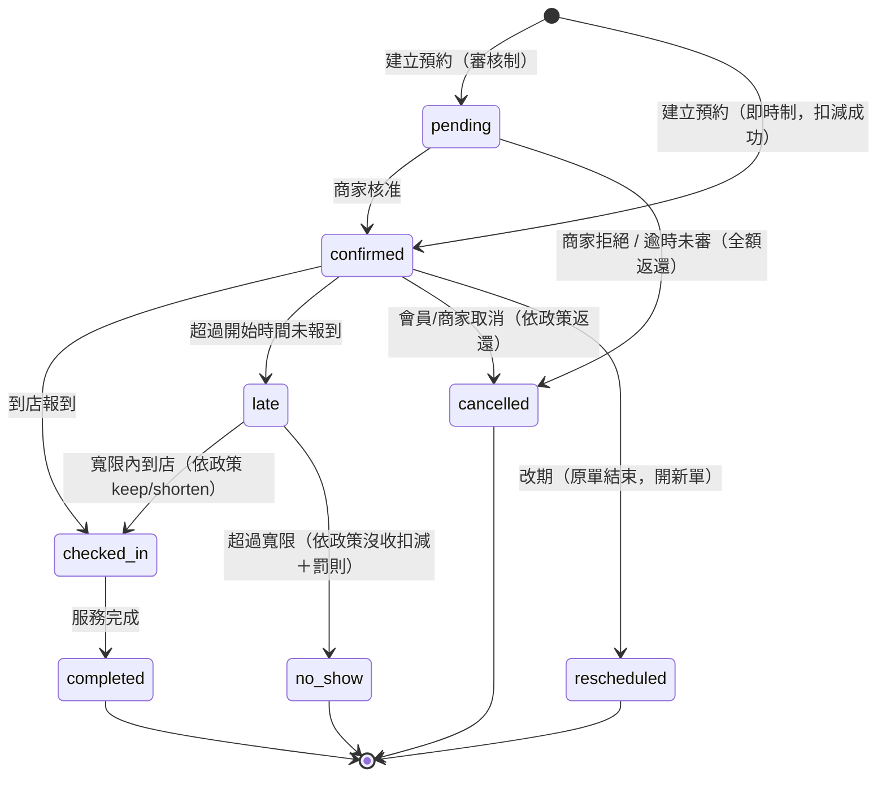
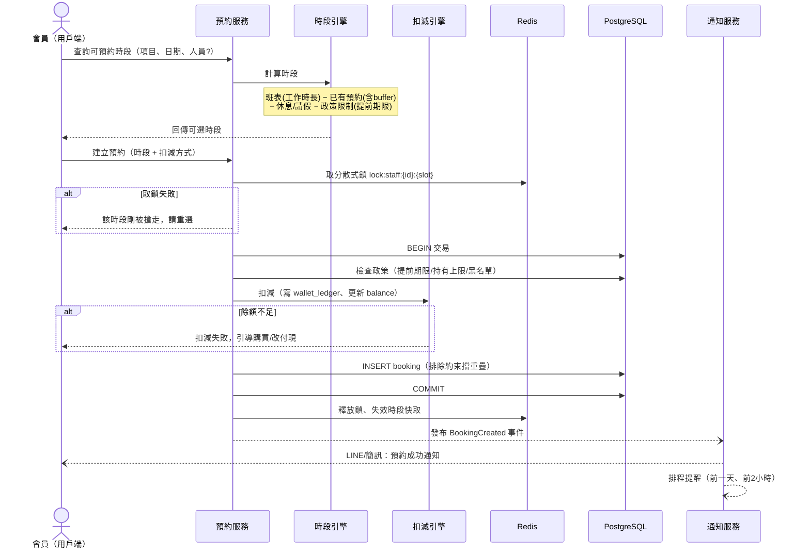
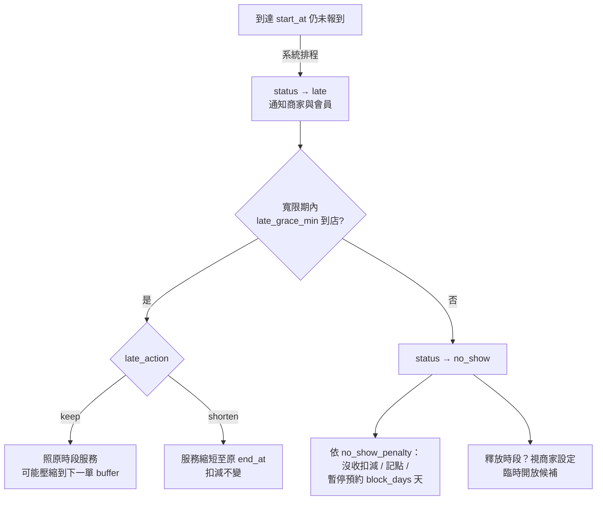

# 04. 核心流程設計

## 1. 預約狀態機（含遲到 / 改期）



**狀態說明**

| 狀態 | 說明 | 扣減 |
|---|---|---|
| pending | 待商家審核（`need_approval=true` 時） | 已預扣（凍結） |
| confirmed | 預約成立 | 已扣減 |
| checked_in | 已報到，服務進行中 | — |
| late | 已超過開始時間、寬限倒數中 | — |
| completed | 服務完成 | 扣減確定 |
| cancelled | 取消 | 依取消政策比例返還 |
| rescheduled | 已改期（軌跡保留，新單接續） | 扣減轉移至新單 |
| no_show | 爽約 | 依政策沒收；累計爽約次數、觸發罰則 |

## 2. 建立預約流程（含扣減與防超賣）



**要點**
- 扣減與建立預約在**同一個 DB 交易**：任一步失敗全部回滾。
- 雙重防超賣：Redis 鎖（快速失敗）＋ DB 排除約束（最終防線）。
- 「不指定人員」：時段引擎回傳「任一可用人員」的聯集時段，成立時以負載均衡指派。

## 3. 可預約時段計算（時段引擎）

```
輸入：service_item（時長+buffer）、日期、staff（可選）、merchant policy

步驟：
1. 取人員當日工作時長：shift_rule 展開 + shift_exception 覆寫
2. 扣除休息時段 break_slots
3. 取當日既有預約的佔用區間（block_start_at ~ block_end_at）
4. 剩餘空檔切成候選時段：
     步進 = 商家設定的時段粒度（例 15/30 分鐘）
     候選需容納 buffer_before + duration + buffer_after
5. 過濾政策：now + min_lead_min 之後、max_lead_days 之內
6. 資源型/團課：再檢查 resource 容量 / 團課剩餘名額
7. 結果快取 Redis（key: 商家:人員:日期），預約異動時主動失效
```

## 4. 改期流程

```
會員發起改期
 ├─ 檢查：距開始時間 > reschedule_deadline_min？
 │    └─ 否 → 拒絕自助改期，提示聯絡商家（商家端可強制改期）
 ├─ 檢查：reschedule_count < max_reschedule？
 ├─ 選擇新時段（同「可預約時段計算」）
 └─ 交易內執行：
      1. 原 booking → status = rescheduled
      2. 建立新 booking（rescheduled_from_id 指向原單，
         reschedule_count + 1，扣減紀錄沿用、不重扣）
      3. 寫 booking_event、通知雙方、重排提醒
```

## 5. 遲到處理流程



- 會員可主動「回報遲到 N 分鐘」（寫入 `late_notified_min`），商家端行事曆即時顯示，由店家決定是否保留。
- `late → no_show` 由背景排程觸發（MQ 延遲任務，在 `start_at + grace` 到期時檢查）。

## 6. 取消與返還

```
會員取消 at T（距開始 D 分鐘）
 └─ 按 cancel_rules 由大到小匹配第一條 before_min ≤ D 的規則：
      例：[{1440,100%}, {120,50%}, {0,0%}]
      D=2000 → 全額返還；D=300 → 返 50%；D=30 → 不返還
 └─ 返還 = 寫一筆 wallet_ledger(+, reason=booking_refund)
 └─ 釋放時段、失效快取、通知商家
```

## 7. 背景任務清單

| 任務 | 觸發 | 動作 |
|---|---|---|
| 預約提醒 | 排程（前 1 天 / 前 2 小時） | 推播通知 |
| 遲到轉爽約 | start_at + grace 延遲任務 | late → no_show + 罰則 |
| pending 逾時 | 建立後 N 分鐘未審核 | 自動取消 + 全額返還 |
| 卡券到期 | 每日掃描 expires_at | 餘額歸零（ledger: expire）+ 到期前 7 天提醒 |
| 報表彙總 | 每日凌晨 | 出席率 / 稼動率 / 營收彙總表 |
