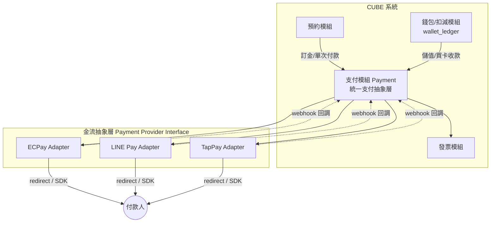
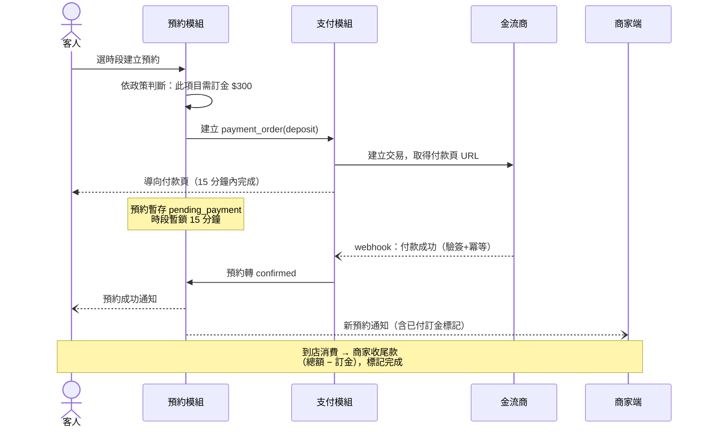

# 07. 支付系統設計（美容院 / 課程型商家）

> 研究日期：2026-07（費率為當時公開資訊，簽約前以金流商報價為準）

## 1. 支付場景分析

美容院與課程型商家的收款特性：**高單價、預約制、重複消費、爽約成本高**。對應五種核心場景：

| 場景 | 說明 | 金額特性 | 建議支付方式 |
|---|---|---|---|
| **訂金/預付** | 預約時先收訂金（降爽約），到店補尾款 | 小額（$100~500 或 訂金比例 %） | LINE Pay、信用卡（一鍵付） |
| **單次服務付款** | 剪髮、單堂體驗課，線上先付或到店付 | 中小額（$500~3,000） | 信用卡、LINE Pay、到店現金/刷卡 |
| **儲值金** | 預存金額享優惠（存 $3,000 送 $300） | 中額（$3,000~10,000） | 信用卡、ATM 轉帳 |
| **堂數卡/課程包** | 10 堂課、半年課程，高單價一次購 | 高額（$10,000~100,000+） | **信用卡分期**（3/6/12 期）、轉帳 |
| **定期課程月繳** | 月費制課程、會籍 | 每月固定 | **信用卡定期定額（綁卡自動扣款）** |

**關鍵洞察**：
1. 課程包單價高 → **不提供分期會直接影響成交率**，分期是課程型商家的必備功能
2. 訂金機制與預約系統深度綁定 → 是降低爽約率最有效的手段（比罰則更前置）
3. 儲值/堂數卡收款後進入 CUBE 的**錢包帳本（wallet_ledger）**，支付系統只負責「錢進來」，後續扣減走既有帳本

## 2. 台灣金流服務商比較

| 服務商 | 信用卡費率 | 撥款速度 | 分期 | 定期定額 | 電子發票 | 適合 |
|---|---|---|---|---|---|---|
| **綠界 ECPay** | ~2.75%（+每筆 $1 處理費） | ~7 天 | ✅ 3/6/12/18/24 期（3.15%~11.55%） | ✅（可同步開發票） | ✅ 一站式 | **首選**：功能最全、API 文件完整、市佔最大 |
| **藍新 NewebPay** | ~2.8% | 7~14 天 | ✅ | ✅ | ✅ | 後台報表較佳，備援選擇 |
| **TapPay** | 議價（量大較優） | 快 | ✅ | ✅ 綁卡（Token）體驗最好 | 需另接 | 中大型量體、想做一鍵付/綁卡 |
| **LINE Pay** | ~3% | ~14 天 | — | — | 需另接 | 25~40 歲客群滲透率最高，美容業主力客群 |
| **Stripe** | 3.4%+NT$10 | 快 | — | ✅ | 需另接 | 有海外客/國際卡需求才考慮 |

### 建議組合（分階段）

```
Phase A（MVP）：綠界 ECPay 全方位金流
  → 一次拿到：信用卡、分期、ATM、超商代碼、Apple/Google Pay、電子發票
  → 一個合約、一套 API，最快上線

Phase B：+ LINE Pay
  → 美容/課程主力客群（25~40 歲女性）LINE Pay 使用率最高
  → 可透過綠界代理收 LINE Pay，或直接與 LINE Pay 簽約（費率較好但要另外對帳）

Phase C（量大後）：+ TapPay 綁卡
  → 會員綁卡後「一鍵付訂金」，把預約→付訂金的流程縮到 3 秒
  → 定期定額月繳課程體驗最順
```

## 3. 支付架構設計



**設計原則**：

1. **Provider 抽象層**：`PaymentProvider` 介面（create / query / refund / webhook 驗證），各金流商做 Adapter。之後加 LINE Pay、換 TapPay 都不動業務邏輯。
2. **不碰卡號**：一律使用金流商的付款頁（redirect）或前端 SDK（TapPay Fields），卡號不經過 CUBE 伺服器 → 免除 PCI DSS 合規負擔。
3. **Webhook 為準**：付款結果以金流商 server-to-server 回調為準（驗簽 + 冪等處理），前端 redirect 回來只當展示用。
4. **對帳兜底**：每日排程拉金流商對帳單，與本地 `payment_order` 核對，差異告警。

## 4. 資料模型

```sql
-- 支付訂單（一次收款請求）
payment_order (
  id, merchant_id, membership_id,
  purpose,             -- deposit(訂金) / service(單次) / stored_value(儲值) /
                       --   pass(堂數卡/課程包) / subscription(定期定額)
  booking_id,          -- purpose=deposit/service 時關聯預約
  pass_product_id,     -- purpose=stored_value/pass 時關聯商品
  amount NUMERIC, currency DEFAULT 'TWD',
  provider,            -- ecpay / linepay / tappay / cash(到店) ...
  provider_order_no,   -- 金流商訂單編號
  method,              -- credit / credit_installment_6 / atm / cvs / linepay / cash
  status,              -- created / paid / failed / expired / refunded / partial_refunded
  paid_at, expired_at,
  idempotency_key UNIQUE
)

-- 支付事件（webhook 原始紀錄，append-only，稽核與重放用）
payment_event (
  id, payment_order_id, provider, raw_payload JSONB,
  verified BOOLEAN, created_at
)

-- 退款
refund (
  id, payment_order_id, amount,
  reason,              -- booking_cancel / dispute / manual
  booking_id,          -- 取消預約觸發時關聯
  status,              -- pending / succeeded / failed
  operated_by_staff_id, note, created_at   -- 誰操作的（接操作紀錄）
)

-- 綁卡（Phase C，token 存金流商，本地只存 token 參照）
payment_card (
  id, membership_id, provider, card_token, last4, brand, expires
)

-- 電子發票
invoice (
  id, payment_order_id, invoice_no, random_no,
  type,                -- B2C / B2B / donate / carrier(載具)
  carrier_no, status,  -- issued / voided / allowance(折讓)
  issued_at
)
```

**與錢包帳本的銜接**（關鍵）：

```
儲值 $3,000 送 $300 的完整流程：
payment_order(purpose=stored_value, amount=3000) → paid
  → 同一交易寫 wallet_ledger +3300（reason=purchase, payment_order_id 關聯）
  → 開立發票 $3,000
之後消費扣款走 wallet_ledger，與金流無關。
退儲值 → 依剩餘比例試算 → refund + wallet_ledger 負向沖銷 + 發票折讓
```

## 5. 核心流程

### 5.1 預約訂金流程（降爽約主力）



- **逾時未付**：15 分鐘未付款 → 釋放時段、預約取消（背景任務）
- **取消退訂金**：商家操作取消時，沿用取消返還試算（cancel_rules），退款走原路（金流 refund API），全程留痕
- **訂金政策**：`booking_policy` 擴充 `deposit_type`（none / fixed / percent）、`deposit_amount`，可依服務項目覆寫（高單價項目才收訂金）

### 5.2 課程包分期付款

```
客人購買 24 堂課 $48,000
 → 選擇分期：3 期（+3.15%）/ 6 期（+4.2%）/ 12 期（+7.35%）
 → 分期手續費由商家吸收或轉嫁（商家後台可設定）
 → 付款成功 = 全額入帳概念（銀行代墊），商家依撥款週期收款
 → wallet_ledger 一次入 24 堂，正常扣課
 ⚠️ 中途退課：課程包退款需按「已上堂數 × 單堂原價」計算退額，
    與信用卡分期的退刷規則（全退/部分退）需在商家條款寫明
```

### 5.3 定期定額（月繳課程）

```
綁卡（TapPay token / 綠界定期定額）
 → 每月 N 號自動扣款 → webhook 成功 → wallet_ledger 入當月堂數 + 自動開發票
 → 扣款失敗：重試 3 次（D+1, D+3, D+7）→ 仍失敗通知商家與會員，凍結會籍
```

### 5.4 到店付款（現金/實體刷卡）

- 到店付款不走線上金流，但**仍建立 payment_order（provider=cash/pos）**由商家端「收款登記」— 目的：營收報表完整、與預約單關聯、操作留痕
- 未來可串市面 POS（如 iCHEF、肚肚）或金流商實體刷卡機，同一套 payment_order 模型

## 6. 電子發票（台灣合規必備）

- 走綠界一站式：付款成功自動開立 B2C 電子發票（存載具/捐贈/紙本）
- 儲值/課程包：收款當下全額開立；退款開折讓單
- 定期定額：每期扣款各開一張（綠界已支援定期定額同步開票）
- `invoice` 表與 `payment_order` 一對一，狀態同步（作廢/折讓）

## 7. 對帳與風控

| 機制 | 說明 |
|---|---|
| 每日對帳 | 排程拉金流商日結檔 vs 本地 `payment_order`，差異寫告警工單 |
| 冪等 | webhook 以 `provider_order_no` 冪等；重複回調不重複入帳 |
| 驗簽 | 所有回調驗 CheckMacValue / 簽章，原始 payload 存 `payment_event` |
| 退款權限 | 退款為敏感操作：Staff 發起 + Owner 覆核（金額門檻可設定），全留 operation_log |
| 撥款現金流 | 綠界 ~7 天、LINE Pay ~14 天 → 商家端報表需分「已收款」與「已撥款」兩個視角 |

## 8. 開發優先序

| 階段 | 內容 |
|---|---|
| P1 | Payment 抽象層 + 綠界（信用卡/ATM）+ webhook/冪等/對帳 + 電子發票 |
| P2 | 訂金流程接入預約（政策設定 + 逾時釋放）＋退款接入取消流程 |
| P3 | 儲值/課程包購買（含分期）接入錢包帳本 |
| P4 | LINE Pay、到店收款登記、退款覆核流 |
| P5 | 綁卡一鍵付、定期定額月繳、POS 串接 |

## 參考資料

- [綠界 vs 藍新 vs Stripe：2026 年台灣金流怎麼選](https://vocus.cc/article/6a0875f3fd897800014813c4)
- [2026 線上金流平台比較：綠界、藍新、LINE Pay](https://hostswp.com/online-payment-platform-comparison/)
- [ECPay 綠界金流 2026 費率、手續費、API 與申請流程](https://site-now.app/ecpay-review/)
- [綠界服務費率表（官方）](https://www.ecpay.com.tw/Business/payment_fees)
- [綠界信用卡分期開通說明](https://shopstore.tw/teachinfo/522)
- [綠界定期定額同步開立電子發票公告](https://www.ecpay.com.tw/Announcement/DetailAnnouncement?nID=3385)
