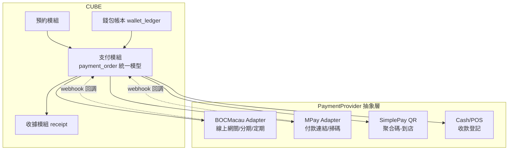

# 07. 支付系統設計（澳門市場：美容院 / 課程型商家）

> 版本 v2：市場定位改為澳門（中銀澳門、MPay 等），並補完整欄位設計。
> 研究日期：2026-07，簽約前以各機構商戶部報價為準。

## 1. 澳門支付生態

### 1.1 主流支付方式

澳門以**二維碼掃碼支付**為主流（信用卡線上收單為輔），且已由金管局推動整合：

| 支付工具 | 營運方 | 說明 |
|---|---|---|
| **聚易用 Simple Pay** | 澳門金管局推動 | **聚合付款碼**：一個 QR 收所有本地錢包（MPay、中銀、豐付寶、工銀 e 支付、廣發、極易付、LusoPay、支付寶澳門） |
| **MPay 澳門錢包** | 澳門通 | 本地滲透率最高的錢包；澳門通商戶服務同時是**聚合收單方**（一台機收 MPay/銀聯/微信/支付寶/Alipay+） |
| **中銀智慧付 / BOC Pay** | 中銀澳門 | 銀行系收單，企業戶常用；線上網關 + 實體 POS |
| 豐付寶 | 大豐銀行 | 銀行系錢包 |
| 工銀 e 支付 / 廣發錢包 / 極易付 / LusoPay | 各銀行/機構 | 經聚易用可收 |
| 微信支付 / 支付寶 / 雲閃付 | 跨境 | 大陸遊客客群必備 |
| Visa / Mastercard 線上收單 | 中銀澳門等銀行 | 課程分期、外籍客群 |

### 1.2 對 CUBE 的意義

1. **收單通道建議**：以「**中銀澳門（線上網關+POS）＋ 澳門通/MPay 商戶服務（聚合掃碼）**」為雙主力 — 你們公司既有合約直接沿用；聚易用讓到店掃碼一碼通收
2. **幣別**：MOP 為主，需支援 HKD（實務通用）與 CNY（跨境錢包結算），欄位要帶幣別與匯率
3. **合規**：澳門**沒有**台灣式電子發票制度 → 改為「收據（receipt）」模型，商家自行開立正式收據/發票（手寫或系統列印），系統負責編號與留存
4. **訂閱/分期**：本地錢包的「定期代扣」支援有限 → 設計上以**信用卡定期扣款（銀行）為主、「每月自動產生收款單+推播付款連結」為降級方案**，欄位需同時支援兩種模式

## 2. 支付場景（美容院 / 課程）

| # | 場景 | 典型金額 | 澳門常用支付 | 對應 purpose |
|---|---|---|---|---|
| S1 | 訂金/預付（降爽約） | MOP 100~500 | MPay 付款連結、掃碼 | `deposit` |
| S2 | 單次服務付款 | MOP 300~2,000 | 到店掃碼（聚易用）、線上付 | `service` |
| S3 | 儲值金 | MOP 1,000~10,000 | 掃碼、信用卡 | `stored_value` |
| S4 | 堂數卡/課程包 | MOP 5,000~80,000 | **信用卡分期**、轉數快/轉帳 | `pass` |
| S5 | 月繳課程/會籍 | 每月固定 | 信用卡定期扣款 / 每月收款單 | `subscription` |
| S6 | 到店付款（現金/POS） | 不限 | 現金、實體 POS | `service`（provider=cash/pos） |
| S7 | 尾款補收 | 總額−訂金 | 到店掃碼/現金 | `balance`（關聯原訂金單） |

## 3. 系統架構：一套模型支援所有場景



**核心設計**：所有場景都收斂到同一張 `payment_order`，用三個欄位區分行為：
- `purpose`（收什麼錢）× `provider`（走哪個通道）× `channel`（線上/掃碼/到店）
- 場景差異全部落在欄位值，不是不同的表 → 新增支付方式只加 Adapter，不改模型

## 4. 完整欄位設計（核心交付）

### 4.1 payment_provider_config — 商家金流通道設定

| 欄位 | 型別 | 必填 | 說明 |
|---|---|---|---|
| id | uuid PK | ✅ | |
| merchant_id | uuid FK | ✅ | 多租戶：每商家自己的收單帳號 |
| provider | enum | ✅ | `boc_macau` / `mpay` / `simplepay` / `alipay` / `wechat` / `cash` / `pos` |
| display_name | text | ✅ | 客人看到的名稱（如「MPay 付款」） |
| merchant_no | text | ✅ | 收單方分配的商戶號 |
| api_key_ref | text | ✅ | 金鑰保管參照（存 KMS/Vault，**不落库明文**） |
| supported_channels | text[] | ✅ | `online` / `qr_mpm`(商家出碼) / `qr_cpm`(掃客人碼) / `pos` |
| supported_purposes | text[] | ✅ | 此通道可用場景（如 MPay 不做分期） |
| currencies | text[] | ✅ | `["MOP","HKD","CNY"]` |
| fee_rate | numeric | | 手續費率（報表用） |
| settlement_days | int | | 撥款天數（現金流報表用） |
| status | enum | ✅ | `active` / `disabled` |
| sort_order | int | | 付款頁顯示順序 |

### 4.2 payment_order — 支付訂單（所有場景共用）

**身份與關聯**

| 欄位 | 型別 | 必填 | 說明 |
|---|---|---|---|
| id | uuid PK | ✅ | |
| merchant_id | uuid FK | ✅ | 多租戶隔離 |
| order_no | text UNIQUE | ✅ | 本系統單號（給金流商與收據用，規則：`P+日期+流水`） |
| membership_id | uuid FK | | 會員（可 NULL：非會員到店消費） |
| guest_name / guest_phone | text | | 非會員時填（對齊 booking 的 guest 設計） |
| booking_id | uuid FK | | S1/S2/S7 關聯預約單 |
| pass_product_id | uuid FK | | S3/S4 關聯儲值/課程包商品 |
| subscription_id | uuid FK | | S5 關聯訂閱合約 |
| parent_order_id | uuid FK | | S7 尾款單指向原訂金單；分期重試單指向原單 |

**金額與幣別**

| 欄位 | 型別 | 必填 | 說明 |
|---|---|---|---|
| currency | char(3) | ✅ | `MOP`（預設）/ `HKD` / `CNY` |
| amount | numeric(12,2) | ✅ | 應收金額（原幣） |
| amount_mop | numeric(12,2) | ✅ | 折算 MOP 金額（報表統一口徑） |
| fx_rate | numeric(10,6) | | 非 MOP 時的採用匯率 |
| discount_amount | numeric | | 優惠折抵（行銷活動） |
| tip_amount | numeric | | 小費（美容業常見，需分開入帳給服務人員） |

**通道與行為**

| 欄位 | 型別 | 必填 | 說明 |
|---|---|---|---|
| purpose | enum | ✅ | `deposit` / `service` / `balance` / `stored_value` / `pass` / `subscription` |
| provider | enum | ✅ | 同 config；`cash`/`pos` 表示到店登記 |
| channel | enum | ✅ | `online`(付款連結/網關) / `qr_mpm` / `qr_cpm` / `pos` / `cash` |
| method | text | | 實際支付工具（回調得知：`mpay`/`bocpay`/`visa`/`alipay`...，聚合碼下單時未知） |
| installment_periods | int | | 分期期數（NULL=不分期；3/6/12） |
| installment_fee_bearer | enum | | `merchant` / `customer` — 分期手續費誰承擔 |
| provider_order_no | text | | 金流商交易號（回調寫入，對帳鍵） |
| payment_url | text | | 付款連結/收銀台 URL（S1 推播給客人用） |
| qr_content | text | | 出碼內容（qr_mpm 時） |
| idempotency_key | text UNIQUE | ✅ | 冪等鍵（防重複建單） |

**狀態與時間**

| 欄位 | 型別 | 必填 | 說明 |
|---|---|---|---|
| status | enum | ✅ | `created` → `pending`(待付) → `paid` / `failed` / `expired` / `cancelled`；退款後 `refunded` / `partial_refunded` |
| expired_at | timestamptz | | 付款期限（訂金 15 分鐘；一般 24 小時），逾時任務掃描 |
| paid_at | timestamptz | | 以 webhook 成功時間為準 |
| created_by_staff_id | uuid FK | | 商家端建單時的操作員工（接操作紀錄體系） |
| source | enum | ✅ | `member_app` / `staff` / `system`(訂閱自動產生) |
| note | text | | 備註 |
| created_at / updated_at | timestamptz | ✅ | |

### 4.3 payment_event — 回調事件（append-only）

| 欄位 | 型別 | 說明 |
|---|---|---|
| id / payment_order_id | uuid | |
| provider | enum | 來源通道 |
| event_type | text | `paid` / `refund_result` / `settlement` ... |
| provider_event_no | text UNIQUE | 金流商事件號（**冪等鍵**：重複回調直接忽略） |
| raw_payload | jsonb | 原始報文全存（稽核/重放/爭議） |
| signature_verified | bool | 驗簽結果；失敗也要落库並告警 |
| processed_at | timestamptz | 業務處理完成時間（NULL=收到未處理，補償任務掃描） |

### 4.4 refund — 退款

| 欄位 | 型別 | 說明 |
|---|---|---|
| id / payment_order_id | uuid | |
| refund_no | text UNIQUE | 本系統退款單號 |
| amount / currency | numeric | 支援部分退款（課程包退課按已上堂數計算） |
| reason | enum | `booking_cancel` / `course_termination`(退課) / `dispute` / `manual` |
| booking_id | uuid | 預約取消觸發時關聯 |
| calc_detail | jsonb | 退款計算快照：`{總額, 已上堂數, 單堂原價, 應退}` — 爭議時舉證 |
| status | enum | `pending_approval` → `approved` → `processing` → `succeeded` / `failed` |
| requested_by_staff_id | uuid | 發起員工 |
| approved_by_staff_id | uuid | 覆核者（Owner；金額門檻 `refund_approval_threshold` 以下可免覆核） |
| provider_refund_no | text | 金流商退款號 |
| refunded_at | timestamptz | |

### 4.5 subscription — 訂閱合約（S5 月繳）

| 欄位 | 型別 | 說明 |
|---|---|---|
| id / merchant_id / membership_id | uuid | |
| pass_product_id | uuid | 月繳商品（每月入 N 堂 / 會籍） |
| billing_mode | enum | `card_auto`(銀行定期扣款) / `invoice_push`(**每月產生收款單推播付款連結** — 本地錢包降級方案) |
| payment_card_id | uuid | card_auto 時的綁卡參照 |
| amount / currency | numeric | 每期金額 |
| billing_day | int | 每月扣款日（1~28） |
| retry_policy | jsonb | `{max: 3, intervals: ["P1D","P3D","P7D"]}` |
| grace_days | int | 付款寬限天數（過期凍結會籍） |
| status | enum | `active` / `past_due`(扣款失敗中) / `paused` / `cancelled` / `completed` |
| current_period_start / end | date | 當期區間 |
| next_billing_at | timestamptz | 排程掃描鍵 |
| cancelled_at / cancel_reason | | 退訂留痕 |

### 4.6 payment_card — 綁卡（token 化）

| 欄位 | 型別 | 說明 |
|---|---|---|
| id / membership_id | uuid | |
| provider | enum | 發 token 的收單方（boc_macau） |
| card_token_ref | text | token 保管參照（**卡號永不落库**） |
| last4 / brand / expiry_ym | text | 顯示用 |
| is_default | bool | |
| status | enum | `active` / `expired` / `removed` |

### 4.7 receipt — 收據（澳門版，取代台灣電子發票）

| 欄位 | 型別 | 說明 |
|---|---|---|
| id / payment_order_id | uuid | 一對一 |
| receipt_no | text UNIQUE | 收據編號（商家前綴+年+流水，連續不可跳號） |
| type | enum | `receipt`(收據) / `invoice`(正式發票，B2B 客戶要求時) |
| title / tax_id | text | 抬頭與稅務編號（B2B） |
| items | jsonb | 品項明細快照 |
| status | enum | `issued` / `voided`；退款時開 `credit_note`（欄位 `credit_note_for` 指向原收據） |
| pdf_url | text | 產出的 PDF 存檔（物件儲存） |
| issued_at | timestamptz | |

### 4.8 settlement_batch / settlement_line — 對帳

| 欄位 | 說明 |
|---|---|
| batch: id, provider, settle_date, file_ref, total_amount, total_count, status(`matched`/`diff_found`) | 每日對帳批次 |
| line: batch_id, provider_order_no, amount, fee, matched_payment_order_id, diff_type(`missing_local`/`missing_provider`/`amount_diff`) | 逐筆核對結果，差異開告警工單 |

### 4.9 booking_policy 擴充 — 訂金政策欄位

| 欄位 | 型別 | 說明 |
|---|---|---|
| deposit_type | enum | `none` / `fixed` / `percent` |
| deposit_amount | numeric | fixed 金額或 percent 百分比 |
| deposit_payment_window_min | int | 付款期限（預設 15 分鐘，逾時釋放時段） |
| deposit_refund_follow_cancel | bool | 訂金退還是否沿用取消返還規則（否=訂金一律不退） |
| deposit_offset_mode | enum | `deduct_balance`(到店折抵尾款) / `deduct_wallet`(入儲值) |

> 訂金政策同樣支援「全店預設 + 服務項目覆寫」（高單價項目才收訂金）。

## 5. 場景 × 欄位對照（驗證模型完備性）

| 場景 | purpose | 關聯鍵 | 關鍵欄位 |
|---|---|---|---|
| S1 訂金 | deposit | booking_id | expired_at=15min、payment_url 推播、deposit_offset_mode |
| S2 單次線上付 | service | booking_id | channel=online |
| S3 儲值 | stored_value | pass_product_id | paid → 同交易寫 wallet_ledger（+含贈額） |
| S4 課程包分期 | pass | pass_product_id | installment_periods、installment_fee_bearer；paid → wallet_ledger 一次入全部堂數 |
| S5 月繳 | subscription | subscription_id | billing_mode、parent 無、每期一張 order（source=system） |
| S6 到店現金/POS | service | booking_id | provider=cash/pos、created_by_staff_id 必填（收款登記留痕） |
| S7 尾款 | balance | booking_id + parent_order_id | amount = 總額 − 訂金單金額 |
| 退課 | — | refund.calc_detail | 部分退款 + credit_note + wallet_ledger 負向沖銷 |

## 6. 關鍵流程（澳門版）

### 6.1 訂金（MPay 付款連結）
```
預約成立(pending_payment) → 建 payment_order(deposit, MOP, expired_at=+15min)
 → 取得 payment_url → LINE/簡訊/App 推播給客人 → 客人 MPay 內完成
 → webhook(驗簽+provider_event_no 冪等) → 預約轉 confirmed → 通知雙方
 → 逾時任務：expired_at 到 → order=expired、釋放時段
到店結帳 → 商家端建尾款單(balance, parent=訂金單) → 掃碼或現金收款登記
```

### 6.2 到店掃碼（聚易用）
```
商家端行事曆點該預約 → 「收款」 → 產生 qr_mpm（聚合碼）金額帶入
 → 客人任一本地錢包掃碼 → webhook 回 method(實際工具) → 單據關聯預約自動完成
```

### 6.3 月繳（雙模式）
```
card_auto：next_billing_at 排程 → 呼叫銀行定期扣款 → 成功入當月堂數+開收據
           失敗 → retry_policy 重試 → 仍敗 → status=past_due、凍結會籍、通知
invoice_push：排程每月產生 order(subscription, source=system) + payment_url
           → 推播「本月學費付款連結」 → 付款成功同上；逾期 grace_days 凍結
```

## 7. 開發優先序（澳門版）

| 階段 | 內容 |
|---|---|
| P1 | payment_order 統一模型 + 中銀澳門線上網關 + webhook/冪等/對帳 + 收據 |
| P2 | 訂金接預約（付款連結+逾時釋放）＋ MPay 付款連結 |
| P3 | 到店收款：現金登記 + 聚易用聚合碼；尾款單 |
| P4 | 儲值/課程包（含信用卡分期）接錢包帳本；退款覆核流 + 退課計算 |
| P5 | subscription 月繳雙模式、綁卡、跨境錢包（微信/支付寶）收遊客 |

## 參考資料

- [聚易用 Simple Pay 介紹（澳門金管局）](https://www.amcm.gov.mo/zh-hant/news-notice/simplepay/simplepay-intro/faq-citizen)
- [中銀智慧付（中銀澳門）](https://aas.bocmacau.com/w/s?q=AS2021031600259814)
- [MPay 澳門錢包（澳門通）](https://www.macaupass.com/MPay)
- [澳門通商戶收款服務](https://www.macaupass.com/business)
- [澳門電子支付現狀分析](https://www.samsonhoi.com/854/macau_e_payment)
