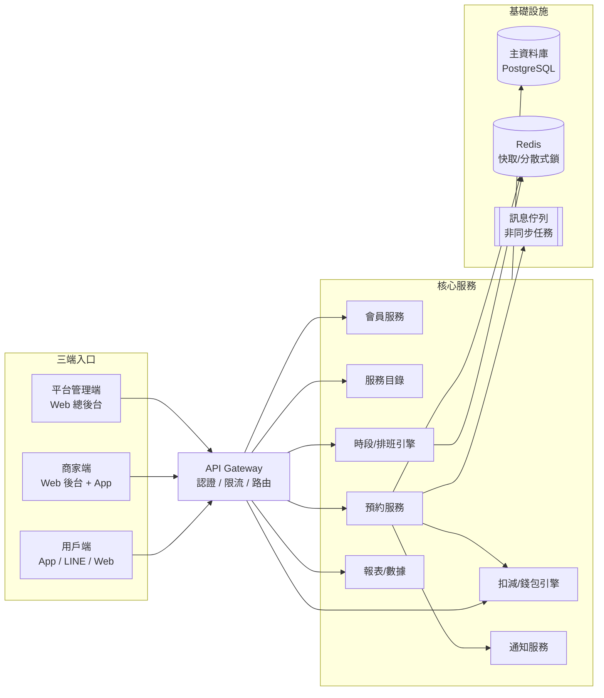

# CUBE 預約系統 — 系統藍圖總覽

> 版本：v0.1（初版藍圖）
> 最後更新：2026-07-10

## 1. 系統定位

CUBE 是一套通用型的預約管理系統，適用於需要「預約 + 扣減（堂數/點數/儲值）」的服務型商家，例如：健身房、瑜伽/舞蹈教室、美容美髮、按摩 SPA、家教課程、共享空間等。

系統核心包含 **三個端**：

| 端 | 使用者 | 定位 |
|---|---|---|
| **用戶端**（C 端） | 消費者 / 會員 | 瀏覽服務、預約、改期、查看扣減紀錄 |
| **商家端**（B 端） | 店家老闆 / 員工 / 服務人員 | 管理服務項目、排班、審核預約、核銷扣減 |
| **平台管理端**（總後台） | 平台營運方 | 商家管理、方案訂閱、全域設定、數據監控 |

> ⚠️ 假設說明：原需求提到「用戶端、商家端、客戶端」，其中「用戶端」與「客戶端」語意重疊，本藍圖將第三端定義為「平台管理端（總後台）」。若「客戶端」另有所指（例如企業客戶端），調整文件 `02-角色與功能.md` 即可。

## 2. 核心能力（對應需求）

| 需求關鍵字 | 系統模組 | 說明 |
|---|---|---|
| 會員 | 會員中心 | 註冊/登入、會員等級、會員卡、標籤分群 |
| 扣減項目 | 扣減引擎 | 堂數卡、點數、儲值金；預約成立即扣、取消返還 |
| 預約項目 | 服務目錄 | 商家可上架的服務/課程，綁定時長與扣減規則 |
| 預約時間 | 時段引擎 | 可預約時段計算（服務時長 × 人員班表 × 資源容量） |
| 服務時長 | 服務目錄 | 每個項目的標準時長 + 緩衝時間（buffer） |
| 工作時長 | 排班模組 | 服務人員的班表、休假、可服務時段 |
| 遲到改期 | 商家端操作 + 策略引擎 | 遲到/改期/取消一律由商家處理；系統提供返還試算、爽約罰則與操作留痕 |

## 3. 文件索引

| 文件 | 內容 |
|---|---|
| [01-架構總覽.md](./01-架構總覽.md) | 系統架構圖、模組劃分、技術選型建議 |
| [02-角色與功能.md](./02-角色與功能.md) | 三端功能清單（Feature List）與權限矩陣 |
| [03-資料模型.md](./03-資料模型.md) | ERD 與核心資料表設計 |
| [04-核心流程.md](./04-核心流程.md) | 預約生命週期、扣減流程、派工、商家端異動處理 |
| [05-API設計.md](./05-API設計.md) | RESTful API 規劃（三端共用 + 分端） |
| [06-開發路線圖.md](./06-開發路線圖.md) | MVP → 迭代的階段規劃 |

## 4. 一頁式全貌

